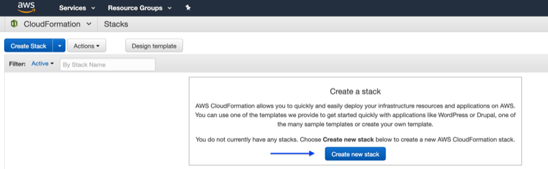
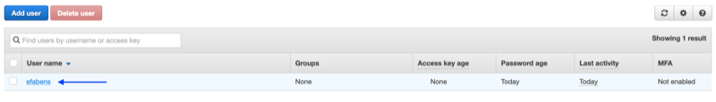
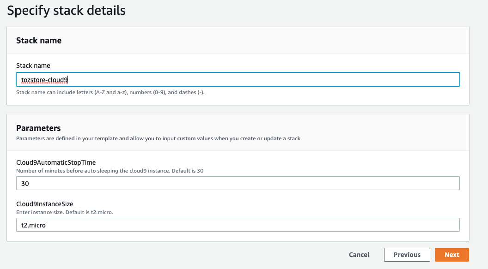

# Cloud9 Environment For Online Processing of TozStore Data

This Repository includes instructions for easily setting up a cloud based command line environment/unix console and IDE
to process large files that are securely stored using TozStore. This document is designed to be usable by people that
have never interacted with Amazon AWS previously. In many cases the official documentation will be linked too, and then
screenshots will be included as additional support.
 
Upon following all of the steps, you will have an AWS account containing an [AWS Cloud9](https://aws.amazon.com/cloud9/)
instance, a cloud based integrated development environment. The Cloud9 instance will contain Python scripts to help download
large files from TozStore, move them to an [AWS S3](https://aws.amazon.com/s3/) bucket on your AWS account and store meta
 data in an [AWS RDS](https://aws.amazon.com/rds/) database running [Postgresql 10](https://www.postgresql.org/), which is also
 hosted on your account.
 
**Things you will need**
 * An E3DB client (If you are part of an institution you may have been provided one, otherwise a new one can be created.
  at [Tozny.com](https://tozny.com))
  * A form of payment for an AWS account, as of February 2019 all of the default values for this project fell into the
  AWS Free tier for new customers.

 
 ## Setting up an Amazon AWS Root Account
 
 The first step is to create a new Amazon AWS Account.
 
 Begin by going to the [AWS Home page](https://aws.amazon.com/) and click on the `Signup` button in the upper right hand
 corner (you may also see a button that says sign up for free, that works as well). You should now be on a page that resembles
 
 
 
 Fill out this page and press continue (as always it is highly recommended to use a new secure password, as this
  account will be linked to a credit card).
 Continue through the rest of the signup flow, including entering a credit card
 and verifying your identity. Additional instructions are available
  [here](https://aws.amazon.com/premiumsupport/knowledge-center/create-and-activate-aws-account/).
 
 
 
 On the *Support Plan* page you can select no support plan needed, as it is not needed for this setup.
 
 
 
 Once completed click on *Sign in to the Console*
 
 
 
 Enter the email address and password that you created during the signup flow and you are in!
 
  ***This is the time to remind you, if you haven't already, to secure your root account password somewhere safe. We recommend
 [1Password](https://1password.com/), alternatively [Lastpass](https://www.lastpass.com/) is also another option.***
 
 ***Enabling Multi-Factor Authentication (MFA, 2FA) for this account is also recommended, instructions are available
 [here](https://docs.aws.amazon.com/IAM/latest/UserGuide/id_credentials_mfa_enable_virtual.html#enable-virt-mfa-for-root)***
 
 ## Creating an administrative user
 
 To follow [AWS best practices](https://docs.aws.amazon.com/IAM/latest/UserGuide/id_root-user.html#id_root-user_manage_mfa)
, the next step is to create a new IAM user with full permissions that is not the root account.
 
 ### Steps
 
 1. Allow IAM users access to the billing dashboard. The instructions can be found here,
 [AWS Instructions](https://docs.aws.amazon.com/awsaccountbilling/latest/aboutv2/grantaccess.html).
    1. Click on your account name in the upper right corner (example-account in the screenshot) and then `My Account`.
    you should now be on a page with `Account Settings` and `Contact Information` sections (and others).
    
        
    
    1. You should now be on a page with `Account Settings ` and `Contact Information` sections (and others). While at
    the top copy down the Account Id (it is a twelve digit number that you will need later).
    
        
        
    1. Halfway down the page should be a section called `IAM User and Role Access to Billing`, depending on your screen
    size, some of that may be truncated. To the right side of that is an `edit` button, click that.
    
        

    1. Select the `Activate IAM Access` checkbox that is now visible and press update. Once clicked that checkbox should
    disappear and a message saying "*IAM user/role access to billing information is activated.*" should be visible.
    
    1. Return to the main console page by clicking on the `AWS` logo in the top left corner of the page.
    
        

1. From the Main page click on `Services` to open the service selector.

    

1. In the upper right corner of the page between the account name and `Support` will be the name of a geographic phrase, such
as `Ohio`, `Oregon`, or `US West`. Click on that to open the region selector. **For later stages of this tutorial you
must select `US West (Oregon)`.** You will now see that the browser url has become `us-west-2.console.aws`,
and the location selector will now say `Oregon`

    
    
    

1. Return to the `Services` drop down. Listed in the `Management & Governance` sections is `CloudFormation` click that. (Alternatively in the find a service
text field, begin typing `CloudFormation` and the result that appears can be clicked on).

    
1. On this page there should be a button that says `Create new stack`. Click that. ***Note there are 2 different cloud
formation UIs at the moment, if the screenshots don't look right in this
section the ones in the next section may be a better visual representation, but the text is very similar***

    
1. On the next page select the `Specify an Amazon S3 template URL` and paste in.
    
    `https://s3.us-west-2.amazonaws.com/tozny-fedramp-cloudformation/v1/cloud-formation-user.json`
    
    and then press next. A copy of that CloudFormation file also lives in this repository at
    [user-cloud-formation](cloudformation/cloud-formation-user.json) for reference.

    
1. The next page has **3** parameters that need to be filled out. Once filled press next.
    1. Stack name: This can be anything you like, but descriptive. Something like `administrative-user-creation` is a
    good choice.
    1. UserName: this is the username that you will use to log in with, I like first initial last name (this value must be 3-41 characters).
    1. UserPassword: this is the password to log in with that user. Notice that this password is only entered once so
    make sure it is correctly entered. This account will be able to spend money so make sure the password is unique and strong
    both password managers mentioned previously can automatically generate a strong password for you.
1. On the next page scroll to the bottom and press next again.
1. You are now on the `Review` page. Scroll to the bottom. You will see a blue alert. Activate the I acknowledge check
    mark and then press create.
    
    

1. This is the stack creation page, you will see that the stack creation process is in progress. This process should
not take more than a minute or two. If you refresh the page it will change to `CREATE_COMPLETE`.
    
    **Before**
    
    
    
    **After**
    
    
    
 1. After this new user has been created, log out of the root user account. (Make sure you have the account id, you will
 need it to login as the new user).
 
 
 ## Logging in as the New IAM User
 
 Now that your new IAM user has been created you can log in as that user.
 
 1. From the main [AWS Page](https://aws.amazon.com/) hover over `My Account`, and then click `AWS Management Console`. This will
 bring you to the root user account login page.
 1. Press the `Sign in to a different account` link.
 1. On that next form enter your 12 digit account number that was written down in the last section and press `next`.
 1. On the next page the account id should be prefilled, and match what was just entered (if not retype the account id). Then enter the username and password of the newly created user and press `Sign In`.

    

 1. You are now logged in and should see in the upper right corner `<Your-user-name@your-account-id>`.
    
 1. It is recommended at this time that you setup MFA for this account as well.
 [AWS Instructions](https://docs.aws.amazon.com/IAM/latest/UserGuide/id_credentials_mfa_enable_virtual.html#enable-virt-mfa-for-iam-user).
    1. From the `Services` dropdown select `IAM` from the `Security, Identity & Compliance` section, or you can search
    for `IAM` and select it.
    1. In the `IAM Resources` Section click `Users: 1` (This number could potentially be different but should be 1 at
    this point if only one IAM user has been created).
    
        
    1. Click on the username that you just logged in as.
    
        
    1. Click on `Security credentials`.
    
        
    1. Click on `Manage` next to `Assigned MFA Devices`.
        
        
    1. Select the type of MFA you want to use, most people will use a virtual MFA such as Google Authenticator, or
    [Authy](https://authy.com/). If you have a hardware device (such as a [Yubi-Key](https://www.yubico.com/)) that will work as well.
    1. Follow the instructions on the prompt (For virtual MFA it will look similar to the below screen grab).
    
    
    
 If you followed this readme as a way to setup a new AWS account and register a single new administrative user you have
 completed that and AWS is now yours to explore! The next sections will setup an infrastructure that can download and
 store large files from TozStore for cloud native secure data processing.
 
 ## Creating an S3 and Cloud9 Stack using CloudFormation
 
We are going to once again use cloud formation to create this stack.

**Make sure that the region has been set to `US-West Oregon` before beginning this process**

**If you are not seeing the orange buttons on CloudFormation page there may be a banner, asking if you want to try the new look
select in the affirmative and it should match the screenshots**

1. From the AWS console page you are going to open the `Services` drop down. Then open `CloudFormation`, either from
`Management & Governance` or by searching. *Tip: On the left side of the Services drop down is the history, which lists the
 four most recently visited services*
1. Click `create stack`.

    
1. Under Specify Template, `Template source` select `Amazon S3 URL`, and paste in

    `https://s3.us-west-2.amazonaws.com/tozny-fedramp-cloudformation/v2/cloud-formation-resources.json`
    
    and click `Next`. **Most of the `Next` buttons in the stack creator requires two clicks to work**
    
    

1. On the next page fill in a stack name, the example images use `tozstore-cloud9`. 

    The other fields can be left as is. If the default parameters do not suit your needs, other options for cloud9 are
    [here](https://aws.amazon.com/ec2/instance-types/) *Note: Other options may not fall in the free tier and some options are very expensive*
    
    
    
    click next
1. The next page is to configure options, in this case no additional configuration is needed, scroll to the bottom and press next.
1. On the review page scroll down to the bottom and press `Create stack`.

    
1. This will bring you to the events page for the stack. The building of this stack will take 10-30 minutes.
1. After some time on the main CloudFormation page you should see a list of two new stacks
(if following this tutorial on a new AWS account, there should be two total stacks). The stack you named in a previous step and
an `aws-cloud9...` stack, this is a sub stack that was created by the main stack.
    
    
    
The infrastructure is now setup, all that is left is bootstrapping and configuration

### Pieces of information you will need for the next step

1. Now that the stack is built, click on the main stack, in the images this is called `tozstore-cloud9`.
1. On this page there is an `outputs` tab, click on that.

    
    
1. On the output page there should be one row with the key, `S3Bucket`. Record the value, for the next step.
    
    

## Bootstrapping

1. Open up the `Services` drop down and select `Cloud9` from under `Developer Tools`, as always you can find this by
typing in the search field as well.

1. On this page you should see an environment names `TA2 Cloud9 Instance`, go ahead and click `Open IDE`.

    

1. It may take a minute to load and then you will see something like this.

    
    

1. You need to clone the git repository this README is in, into the cloud 9 instance. To do that type
 `git clone https://github.com/tozny/tozstore-cloud9-integration.git` into the terminal at the bottom.
 
    
 
1. There will now be a new folder on the left hand side called `tozstore-cloud9-integration`.

1. type `cd tozstore-cloud9-integration`. You will now be in the `tozstore-cloud9-integration` folder.

1. Install the `AWS CLI`. This tool will allow you to upload files from cloud9 to the s3 bucket you created, in a previous step.  Type `make aws`. There will be many lines of output. When complete if you type `aws` you should see 

    ```
        usage: aws [options] <command> <subcommand> [<subcommand> ...] [parameters]
        To see help text, you can run:

        aws help
        aws <command> help
        aws <command> <subcommand> help

        aws: error: the following arguments are required: command
    ```

1. Now you will need to download the Wash Helper Folder, Found in the [WASH Portal](https://wash.fedramp.tozny.com/) under the Support Page.

1. Once you have Downloaded the File locally, you can drag and drop into your Cloud9 instance or use File > Upload Local Files. For further details on how to run the script, look at the ReadMe.md found in the Wash Helper Folder. 

1. Using the WASH helper scripts you may download any files that you need. Those files will be placed into a directory called `downloads`, if the above instructions were followed exactly it will likely be at `~/environment/wash-helpers-0.6/downloads`. 

1. The cloud9 instance has a limited amount of hard drive space, in addition this hard drive is not easily accessible to download data from at a later date. To solve these two issues, we will move downloaded data from cloud9 to the S3 bucket that was created. After it has been transferred we will remove the local downloads, to free up space for more data to be downloaded

1. Navigate to the downloads folder `cd ~/environment/wash-helpers-0.6/downloads`

1. Transfer the directory to S3 `aws s3 cp --recursive ./ s3://<BUCKET-NAME-FROM-OUTPUT>/wash-data` the previous command uses the AWS CLI S3 tool to copy, recursively, the current directory to your S3 bucket in the `wash-data` directory.

1. In the AWS console you can navigate to the S3 resource and see the bucket that you have created. Clicking into it you will see all of the files that have been transferred to it.

1. Once transferred, the files can be removed from the cloud9 local disk. To accomplish this, in the file viewer find the `downloads` directory. Right click it and select `delete`. Click `yes` on the confirmation box. The wash helper scripts track all downloaded files so even if they have been deleted locally they will not be downloaded again.

## Downloading data

This environment is now all setup and ready to go.  You can close the Cloud9 instance and reopen it by clicking `launch ide`.
If the environment is closed for an extended period of time (by default configured to 30 minutes) the instance will shut down,
all this means is that the next time you launch the instance it will take a little while longer. But it will come back just the way you left it.

### Advanced searching

The search system is backed by an elastic search like system, that can run a very broad type of search queries. For full
 class documentation see [here](https://github.com/tozny/e3db-python/blob/master/e3db/types/search.py#L278) and for some
 simple examples see [here](https://github.com/tozny/e3db-python/blob/master/README.md)

